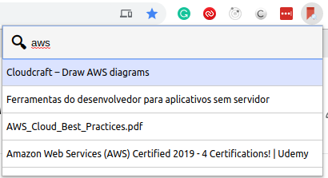

Find and open bookmarks or history items quicker than using the browser's address bar.
It'll search the items on Bookmarks first then on the History list, and will show unique items based on the URL.

# How it looks like

# Keyboard Interaction
You can open it at any time by firing `CTRL+SHIFT+F`. (or `COMMAND+SHIFT+F` on Mac)
You can navigate between options with `Arrow Up` and `Arrow Down`.
And you can open the item by pressing `Enter`.

# Installation
[Latest version](https://github.com/ramonpm/go-to-bookmark/releases/latest/download/go-to-bookmark.zip)

You can clone this repository and build it by yourself or download the latest version above.

1. Open the Extension Management page by navigating to chrome://extensions.
2. Enable Developer Mode by clicking the toggle switch next to Developer mode.
3. Click the LOAD UNPACKED button and select the extension directory, either built by yourself or extracted from the latest version.
